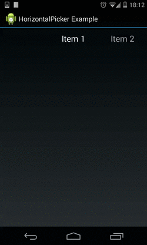

HorizontalPicker
================

HorizontalPicker is an open source android library that enables users to select single item
by scrolling or tapping left and right to move between an array of items.

[](https://maven-badges.herokuapp.com/maven-central/com.wefika/horizontal-picker)
[](https://android-arsenal.com/details/1/1298)

Example
-------


Dependencies
------------

    compile 'com.wefika:horizontal-picker:1.1.1'

Usage
-----

```xml
<com.wefika.horizontalpicker.HorizontalPicker
        xmlns:picker="http://schemas.android.com/apk/res/com.wefika.horizontalpicker"
        android:layout_width="match_parent"
        android:layout_height="wrap_content"
        android:textColor="@color/textColor"
        android:textSize="@dimen/textSize"
        android:ellipsize="none | start | middle | end | marquee"
        android:marqueeRepeatLimit="-1"
        picker:values="@array/values"
        picker:dividerSize="@dimen/itemPadding"
        picker:sideItems="@integer/sideItems" />
```

License
-------

    Copyright 2014 Blaž Šolar

    Licensed under the Apache License, Version 2.0 (the "License");
    you may not use this file except in compliance with the License.
    You may obtain a copy of the License at

        http://www.apache.org/licenses/LICENSE-2.0

    Unless required by applicable law or agreed to in writing, software
    distributed under the License is distributed on an "AS IS" BASIS,
    WITHOUT WARRANTIES OR CONDITIONS OF ANY KIND, either express or implied.
    See the License for the specific language governing permissions and
    limitations under the License.
